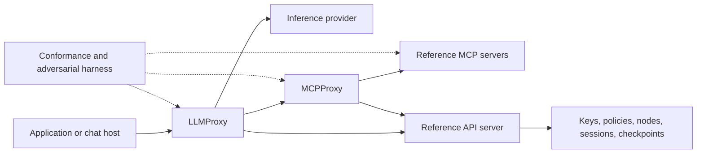

# Architecture

## Boundaries

The diagram is the target mediated deployment. None of these network paths is active in the scaffold. The reference LLMProxy must own the dispatch loop or integrate with a chat host that does; merely forwarding model API traffic cannot enforce CDL Topology B's complete-mediation promise.

| Component | Scope | Exclusions |
| --- | --- | --- |
| `core` | PSP syntax, envelope types, canonicalization, signature verification, trust/provenance, workflow state contracts | Private-key management service and model attention masking |
| `cdl` | Declarations, inheritance/negation, vocabulary registry and deterministic policy decision point (PDP) | Inferring truth of compliance or capability claims |
| `llmproxy` | Provider adapters, prompt construction, model/tool loop, output gating, refresh and completion policy | Treating model-generated authorization as authoritative |
| `mcpproxy` | MCP client/server mediation, tool allow-lists, covenant checks, provenance | An unrestricted generic HTTP forward proxy |
| `mcp-server` | Sessions, nodes, checkpoints, security tools and synthetic governed data | The commercial RealflowCloud backend |
| `api-server` | Authentication boundary, versioned HTTP contracts and service adapters | Inventing an existing RFC-PSP-API |
| `test-harness` | Language adapter contract, conformance execution, topology scenarios and result recording | Treating unimplemented or skipped checks as passes |

The language packages share JSON contracts and vectors, not cryptographic implementations. Keep deterministic parsing/policy code separate from I/O and from probabilistic threat assessment. Use maintained cryptographic libraries rather than custom primitives.

The initial policy contract is [CDL Deterministic Policy Profile 1.0](../specs/profiles/CDL-DETERMINISTIC-1.0.md), paired with [PSP Trust and Enforcement Profile 1.0](../specs/profiles/PSP-TRUST-1.0.md). Retain each restriction's originating authority and bind every decision to the checked operation. Capability union never supplies proof that a safeguard executed; trusted check adapters and enforced obligations belong behind the service authentication boundary.

## Enforcement model

Map Topology A to semantic-only experiments; Topology B to an authoritative chat-host/LLMProxy dispatch loop; Topology C additionally mediates MCP and enforces output covenants at servers. Declare all enabled enforcement points in each run. Layers that share a library, signing authority, or configuration may have correlated failures; do not assume statistical independence.

Credentials, private keys, and authoritative node/session identity stay outside model-visible input. Before side effects, bind identity, session, active node, policy version, tool identifier and capability provenance. Validate returned schemas/provenance and enforce display covenants before releasing buffered output. Streaming requires an explicit gating policy before any confidential bytes leave the boundary.

## Contract evolution

`schemas/` contains project-owned draft contracts; a schema does not establish normative RFC semantics. `conformance/requirements.json` is the starter traceability register, not a complete extraction. Version protocol profiles, API contracts and implementation packages independently. Changes to shared schemas require coordinated language review.

## Reusable library layer

`core` and `cdl` now provide the shared experimental implementation described in the [API guide](library-api.md). Proxies, MCP/API servers and eventual model adapters must consume these libraries rather than create parallel parsers. Markup, native objects, JSON documents and signed envelopes share a versioned reversible tree. Node crypto is an explicit subpath; pure codec/policy imports do not import Node built-ins. Python has the same separation. Finite policy tables are packaged with each CDL library, with tests against the normative sources.

The library harness executes profile fixtures without running servers or tools. Network services remain unimplemented. An integration must construct authenticated facts, resolve every contributing data location, preserve policy origins, bind decisions to operations, and enforce them before side effects.
