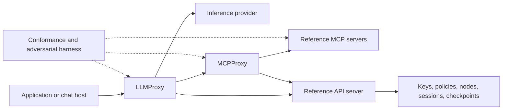

# Architecture

## Boundaries

The diagram is the target mediated deployment. The first read-only security service adapters are implemented; the full mediated workflow remains pending. The reference LLMProxy must own the dispatch loop or integrate with a chat host that does; merely forwarding model API traffic cannot enforce CDL Topology B's complete-mediation promise.

| Component | Scope | Exclusions |
| --- | --- | --- |
| `core` | PSP syntax, envelope types, canonicalization, signature verification, trust/provenance, workflow state contracts | Private-key management service and model attention masking |
| `cdl` | Declarations, inheritance/negation, vocabulary registry and deterministic policy decision point (PDP) | Inferring truth of compliance or capability claims |
| `llmproxy` | Provider adapters, prompt construction, model/tool loop, output gating, refresh and completion policy | Treating model-generated authorization as authoritative |
| `mcpproxy` | MCP client/server mediation, tool allow-lists, covenant checks, provenance | An unrestricted generic HTTP forward proxy |
| `mcp-server` | Sessions, nodes, checkpoints, security tools and synthetic governed data | The commercial RealflowCloud backend |
| `api-server` | Authentication boundary, versioned HTTP contracts and service adapters | Inventing an existing RFC-PSP-API |
| `test-harness` | Language adapter contract, conformance execution, topology scenarios and result recording | Treating unimplemented or skipped checks as passes |

The language packages share JSON contracts and vectors, not cryptographic implementations. Keep deterministic parsing/policy code separate from I/O and from probabilistic threat assessment. Use maintained cryptographic libraries rather than custom primitives.

The initial policy contract is [CDL Deterministic Policy Profile 1.0](../specs/profiles/CDL-DETERMINISTIC-1.0.md), paired with [PSP Trust and Enforcement Profile 1.0](../specs/profiles/PSP-TRUST-1.0.md). Retain each restriction's originating authority and bind every decision to the checked operation. Capability union never supplies proof that a safeguard executed; trusted check adapters and enforced obligations belong behind the service authentication boundary.

## Enforcement model

Map Topology A to semantic-only experiments; Topology B to an authoritative chat-host/LLMProxy dispatch loop; Topology C additionally mediates MCP and enforces output covenants at servers. Declare all enabled enforcement points in each run. Layers that share a library, signing authority, or configuration may have correlated failures; do not assume statistical independence.

Credentials, private keys, and authoritative node/session identity stay outside model-visible input. Before side effects, bind identity, session, active node, policy version, tool identifier and capability provenance. Validate returned schemas/provenance and enforce display covenants before releasing buffered output. Streaming requires an explicit gating policy before any confidential bytes leave the boundary.

## Contract evolution

`schemas/` contains project-owned draft contracts; a schema does not establish normative RFC semantics. `conformance/requirements.json` is the starter traceability register, not a complete extraction. Version protocol profiles, API contracts and implementation packages independently. Changes to shared schemas require coordinated language review.

## Reusable library layer

`core` and `cdl` now provide the shared experimental implementation described in the [API guide](library-api.md). Proxies, MCP/API servers and eventual model adapters must consume these libraries rather than create parallel parsers. Markup, native objects, JSON documents and signed envelopes share a versioned reversible tree. Node crypto is an explicit subpath; pure codec/policy imports do not import Node built-ins. Python has the same separation. Finite policy tables are packaged with each CDL library, with tests against the normative sources.

The library harness executes profile fixtures without running servers or tools. Read-only security adapters and opt-in [workflow HTTP/MCP adapters](workflow-api.md) use these libraries. An integration must construct authenticated facts, resolve every contributing data location, preserve policy origins, bind decisions to operations, and enforce them before side effects.

The [service layer](service-api.md) resides in `api-server`, independently of transport. Both HTTP and `mcp-server` depend on it; it depends only on core/CDL and host authority interfaces. This dependency direction prevents parser, verification and policy copies inside transports. There is no service listener or credential lookup on import.

The [persistence layer](persistence.md) is an explicit `api-server` submodule. `WorkflowStore` owns state transitions and depends on a replaceable atomic compare-and-write backend; `SqliteBackend` supplies local durable transactions in both languages. Core/CDL imports remain independent of storage. Hosts authenticate actors, authorize transitions and approve the full write set against persistence policy before a commit. Database atomicity covers state, checkpoint consumption and receipts; remote tool effects need a future outbox/recipient-idempotency contract.

`WorkflowService` provides an opt-in authenticated boundary around the store. A per-request guard authorizes exact planned transitions and historical receipt reads; transports expose projected application data and checkpoint selectors. Resume credentials use private host callbacks. `SessionOperations` issues bounded process-local handles and resolves fresh keys/evidence against live durable session/node/policy/epoch bindings. Restart requires new handles; multi-worker coordination remains separate work.

The first [MCP dispatch gate](mcp-dispatch.md) depends on core/CDL and the explicit workflow store API. An optional `OwnerCoordinator` shared by every writer and gate prevents competing owner transitions through the full local read-only dispatch/release interval. Endpoint identity and capabilities come from host-authenticated immutable registrations. Per-call policy resources, recipient capabilities and revision checks are supplied outside model input. The gate buffers a bounded object, emits level-5 local provenance, and rejects mutating endpoints. The gate alone is not a network MCP proxy, model loop or complete topology implementation; distributed dispatch and durable effect recovery remain separate work.

The opt-in [stdio mediation adapter](mcp-stdio.md) adds `mcpproxy → mcp-server → api-server` dependencies. `McpServer` accepts a host tool-service adapter while preserving the security/workflow adapter. The proxy service supplies only gate-backed discovery and calls, pins the initialized principal again at gate entry, and emits checked structured data with provenance in MCP metadata. `StdioMcpClient` owns a dedicated host-approved child, verifies schemas against approvals and rechecks a pinned discovery digest before/after calls. It never relays raw upstream methods or downstream content/metadata. Static local launcher identity and observed discovery checks do not supply atomic remote revision preconditions or remote TLS/OAuth authentication.

The opt-in [HTTP mediation adapter](mcp-http.md) reuses pinned peer discovery and the dispatch gate. Hosts validate audience-bound resource credentials and provide request-local services; transport sessions pin owner identity in bounded process memory. TLS authenticates remote endpoints. Concurrent cancellation reaches host controls and suppresses late output; JSON and finite SSE are buffered before release. Durable workflow state remains in the persistence layer. OAuth client flows and distributed transport-session recovery are separate work.

The opt-in [revision extension](mcp-revision.md) negotiates catalog/tool/input preconditions outside tool arguments. A receiving `RevisionedToolRegistry` selects a callback atomically with a process-local lease that blocks publication through buffered completion and release authorization. Remote receipts are checked consistency metadata, not authority. The host reviews a fresh peer snapshot before replacing an idle gate and separately publishes matching authority; the gap fails stale. All gates and publishers in a deployment must share host coordination. No model-visible administration endpoint or hosted approval service is added.

The opt-in [buffered model/tool loop](llm-loop.md) adds `llmproxy → mcpproxy/api-server/core/cdl` dependencies. It shares the gate's store/coordinator, holds owner reservations during inference and release, and uses an additional host-only dispatch check for transcript-derived restrictions. The provider sees separated messages and discovered tools, while credentials, keys and authoritative bindings remain host-owned. Signed prompt verification and current policy/session checks repeat at boundaries. A final answer alone does not complete a durable session.

The separate [durable loop](llm-durable.md) buffers that answer until a host-approved
turn commits application state and an immutable answer receipt atomically. Its
explicit lockdown mode writes terminal metadata outside application state and
rejects later conversational input before inference, with a host audit callback.
Historical recovery requires current identity, authorization, retained policy
origins and release checks. Compare-and-write serializes competing state commits;
inference/tool execution is not exactly once. The separate redirect profile described below extends completion; scoped
continuation and streaming remain future work.

The separate [refresh loop](llm-refresh.md) obtains signed host-approved replacements
before inference and preserves the complete transcript for policy checks. Accepted
metadata is durable before use, while session state, answer receipts and turn
counters commit atomically. Only prompt metadata writes may borrow the loop's live
owner reservation. Expiration during provider/tool execution suppresses the pending
result; refreshing cannot authorize replay of that result. Signers, compatibility
approval, audit acceptance and retained policy origins remain host responsibilities.

The opt-in [MCP prompt refresh adapter](llm-mcp-refresh.md) binds a host-only control channel to one approved peer/catalog and exact owner/session. It never registers refresh with the model dispatch gate. The remote service resolves signing authority independently; only the existing refresh loop can verify and approve a candidate for inference.

The opt-in [redirect loop](llm-redirect.md) resolves a host-selected application locally, evaluates a separately bound CDL transfer decision, and atomically completes the source with a fresh same-owner target and immutable receipt. The target receives only output and retained policy evidence; its own host initializes fresh threat state, signed prompts and gate authority. Current-policy recovery returns historical routing information without creating or invoking another target.
